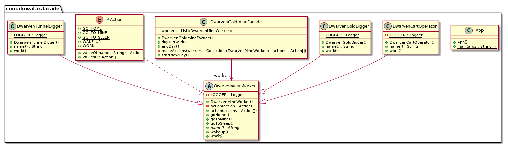

---

layout:  pattern

title: Facade

folder: facade

permalink: /design-pattern-in-java/facade/

categories: Structural

tags:

	- Gang of Four
	- Decoupling

---


## Intent

Provide a unified interface to a set of interfaces in a subsystem.

Facade defines a higher-level interface that makes the subsystems easier to use. 

## Explanation

Real world example

> How does a goldmine work? "Well, the miners go down there and dig gold!" you say. That is what you believe because  you are using a simple interface that goldmine provides on the outside, internally it has to do a lot of stuff to make it happen. This simple interface to the complete subsystem is a facade.

In plain words

> Facade pattern provides a simplified interface to a complex subsystem.

Wikipedia says

> A facade is an object that provides a simplified interface to a large body of code, such as a class library.

**Programmatic  Example**

Taking our goldmine example from above. Here we have the Daven mine worker hierarchy. 

```java
public abstract class DavenMineWorker {
    public static final Logger LOGGER = LoggerFactory.getLogger(DavenMineWorker.class);

    public void goToSleep() {
        LOGGER.info("{} goes to sleep.", name());
    }

    public void wakeUp() {
        LOGGER.info("{} wakes up", name());
    }

    public void goHome() {
        LOGGER.info("{} goes home.", name());
    }

    public void goToMine() {
        LOGGER.info("{} goes to the mine.", name());
    }

    private void action(Action action) {
        switch (action) {
            case GO_TO_SLEEP:
                goToSleep();
                break;
            case WAKE_UP:
                wakeUp();
                break;
            case GO_HOME:
                goHome();
                break;
            case GO_TO_MINE:
                goToMine();
                break;
            case WORK:
                work();
                break;
            default:
                LOGGER.info("Undefined action");
                break;
        }
    }

    /**
     * Perform actions
     * @return
     */

    public void action(Action...actions){
        Arrays.stream(actions).forEach(this::action);
    }

    public abstract void work();

    public abstract String name();

    enum Action {
        GO_TO_SLEEP, WAKE_UP, GO_HOME, GO_TO_MINE, WORK
    }
}
```

To operate all these goldmine works we have the facade

```java
public class DavenGoldmineFacade {
    private final List<DavenMineWorker> workers;

    public DavenGoldmineFacade() {
        workers = List.of(
                new DavenCartOperator(),
                new DavenGoldDigger(),
                new DavenTunnelDigger()
        );
    }

    public void startNewDay(){
        makeActions(workers, DavenMineWorker.Action.WAKE_UP, DavenMineWorker.Action.GO_TO_MINE);
    }

    public void digOutGold(){
        makeActions(workers, DavenMineWorker.Action.WORK);
    }

    public void endDay(){makeActions(workers, DavenMineWorker.Action.GO_HOME, DavenMineWorker.Action.GO_TO_SLEEP);}

    private void makeActions(List<DavenMineWorker> workers, DavenMineWorker.Action... actions) {
        workers.forEach(worker -> worker.action(actions));
    }
}
```

Now to use the facade

```java
public class DavenGoldmineFacade {
    private final List<DavenMineWorker> workers;

    public DavenGoldmineFacade() {
        workers = List.of(
                new DavenCartOperator(),
                new DavenGoldDigger(),
                new DavenTunnelDigger()
        );
    }

    /**
     * Dwarf gold digger wakes up and got to the mine.
     * Dwarf cart operator wakes up and got to the mine
     * Dwarf tunnel digger wakes up and go to the mine
     * */
    public void startNewDay(){
        makeActions(workers, DavenMineWorker.Action.WAKE_UP, DavenMineWorker.Action.GO_TO_MINE);
    }

    /**
     * Dwarf gold digger digs for the gold
     * Dwarf cart operator moves gold chunks out of the tunnel
     * Dwarf tunnel digger create another promising tunnel
     * */
    public void digOutGold(){
        makeActions(workers, DavenMineWorker.Action.WORK);
    }

    /**
     * Dwarf gold digger goes home and go to sleep.
     * Dwarf cart operator goes home and go to sleep.
     * Dwarf tunnel digger goes home and go to sleep.
     * */
    public void endDay(){makeActions(workers, DavenMineWorker.Action.GO_HOME, DavenMineWorker.Action.GO_TO_SLEEP);}

    private void makeActions(List<DavenMineWorker> workers, DavenMineWorker.Action... actions) {
        workers.forEach(worker -> worker.action(actions));
    }
}
```

## Class diagram




## Applicability

Use the Facade pattern when

* you want to provide a simple interface to a complex sub-systems. Subsystems often get more complex as they evolve. Most patterns, when applied, result in more and smaller classes. This makes the subsystem more reusable and easier to customize, but it also becomes harder to use for clients that don't need to customize it. A facade can provide a simple default view of the subsystem that is good enough for most clients. Only clients needing more customizability will need to look beyond the facade.
* there are many dependencies between clients, and the implementation classes of an abstraction. Introduce a facade to decouple the subsystem from clients and other subsystems, thereby promoting subsystem independence and portability.
* you want to layer your subsystems. Use a facade to define an entry point to each subsystem level. If subsystems are dependent, then you can simplify the dependencies between them by making them communicate with each other through their facades.

## Credits

* [Design Patterns: Elements of Reusable Object-Oriented Software](http://www.amazon.com/Design-Patterns-Elements-Reusable-Object-Oriented/dp/0201633612)

  

